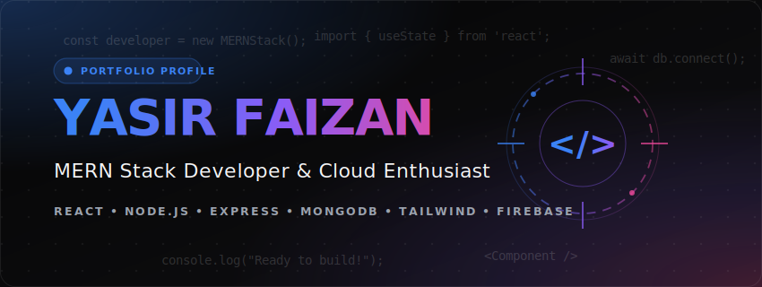

  
  
    
  
  
  
   
  
  
  
  
  

---

<table align="center" width="100%">
  <tr>
    <td valign="top" width="55%">
      <h3>🌟 About Me</h3>
      
I am a detail-oriented <b>Full-Stack &amp; MERN Developer</b> with a passion for designing scalable, interactive, and highly responsive web applications. I love bridging the gap between user-centric design and powerful back-end architecture. I work extensively with <b>React, Node.js, Express, and MongoDB</b>, transforming abstract concepts into pixel-perfect, structured realities.

       
      <h4>🎯 Focus &amp; Principles</h4>
      <ul>
        <li>🚀 <b>Performance:</b> Optimized front-ends &amp; highly scalable REST APIs</li>
        <li>🎨 <b>Sleek UI/UX:</b> Interactive web apps with premium glassmorphic styling</li>
        <li>⚙️ <b>Clean Architecture:</b> DRY code, modular components, robust folder structures</li>
        <li>☁️ <b>Deployment:</b> Version control &amp; Cloud ecosystem integrations</li>
      </ul>
    </td>
    <td valign="top" width="45%">
      <h3>⚡ Current Activities</h3>
      <ul>
        <li>🔭 <b>Working on:</b> Enterprise MERN Stack Solutions</li>
        <li>🌱 <b>Learning:</b> Docker orchestration &amp; System Design Patterns</li>
        <li>💡 <b>Expertise:</b> Database modeling (Mongoose) &amp; Auth flows</li>
        <li>🤝 <b>Collab:</b> Open-source projects &amp; creative web designs</li>
      </ul>
       
      

        
      

    </td>
  </tr>
</table>

---

  <h2>💻 Core Expertise</h2>

<table align="center" width="100%">
  <tr>
    <td align="center" width="25%">
       
      <b>Responsive Design</b> 
      Pixel-perfect, fluid layouts
    </td>
    <td align="center" width="25%">
       
      <b>React Frontend</b> 
      State management &amp; component architecture
    </td>
    <td align="center" width="25%">
       
      <b>Backend &amp; APIs</b> 
      Secure, high-concurrency endpoints
    </td>
    <td align="center" width="25%">
       
      <b>MERN Stack</b> 
      Seamless database to client integrations
    </td>
  </tr>
</table>

---

  <h2>🛠️ Tech Arsenal</h2>
  
My core toolset for turning complex ideas into functional web experiences.

  

 

  <table width="90%">
    <tr>
      <td align="left">
        <b>🎨 Frontend:</b> <code>HTML5</code> <code>CSS3</code> <code>JavaScript</code> <code>TypeScript</code> <code>Tailwind CSS</code> <code>Bootstrap</code> <code>React.js</code> <code>Redux Toolkit</code>
      </td>
    </tr>
    <tr>
      <td align="left">
        <b>⚙️ Backend &amp; DB:</b> <code>Node.js</code> <code>Express.js</code> <code>MongoDB</code> <code>Mongoose</code> <code>REST APIs</code>
      </td>
    </tr>
    <tr>
      <td align="left">
        <b>🔧 Tools &amp; Cloud:</b> <code>Git</code> <code>GitHub</code> <code>Firebase</code> <code>Vite</code> <code>NPM</code> <code>VS Code</code>
      </td>
    </tr>
  </table>

---

  <h2>🚀 Featured Projects</h2>

<table align="center" width="100%">
  <tr>
    <td width="50%" valign="top">
      <h3>🔗 Chain Forge</h3>
      
<i>The "Firebase for Web3" helping connect wallets, process transaction details, and generate API keys.</i>

      

        
        
        
      

      <a href="https://github.com/Yasirfaizan/chainforge"><b>💻 Repo</b></a> | <a href="https://chainforge-henna.vercel.app/"><b>🌐 Live Demo</b></a>
    </td>
    <td width="50%" valign="top">
      <h3>🏥 Clinic Management System</h3>
      
<i>A full-featured management tool designed to coordinate patient appointments and prescriptions.</i>

      

        
        
        
        
      

      <a href="https://github.com/Yasirfaizan/MedFlow"><b>💻 Repo</b></a> | <a href="https://med-flow-two-livid.vercel.app/"><b>🌐 Live Demo</b></a>
    </td>
  </tr>
  <tr>
    <td width="50%" valign="top">
      <h3>🎓 Aziz Jan Trust</h3>
      
<i>A live, production-grade website for a KPK-based trust institute providing free education.</i>

      

        
        
        
      

      <a href="https://github.com/Yasirfaizan/Aziz-Jan-Trust"><b>💻 Repo</b></a> | <a href="https://aziz-jan-trust.vercel.app/"><b>🌐 Live Demo</b></a>
    </td>
    <td width="50%" valign="top">
      <h3>🏫 Peshawar Model School</h3>
      
<i>An educational and platform landing designed with react frontend routing and modern elements.</i>

      

        
        
        
      

      <a href="https://github.com/Yasirfaizan/PMDC-School-React"><b>💻 Repo</b></a> | <a href="https://pmdc-school-react.vercel.app/"><b>🌐 Live Demo</b></a>
    </td>
  </tr>
</table>

---

  <h2>📈 GitHub Analytics</h2>

<table align="center" width="100%">
  <tr>
    <td align="center" width="50%">
      
    </td>
    <td align="center" width="50%">
      
    </td>
  </tr>
</table>

   
  

---

  <h2>💭 Dev Wisdom</h2>
   
  

---

  <h2>📫 Let's Connect!</h2>
  
<b>I'm always excited to collaborate on interesting projects or discuss web development!</b>

  
  
  
  

    

  

    
  
  <i>"Any fool can write code that a computer can understand. Good programmers write code that humans can understand." – Martin Fowler</i>

